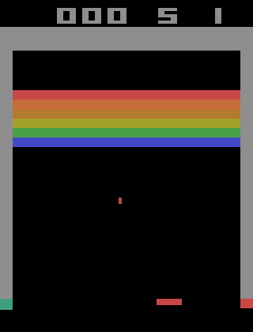

 

# Double Deep Q-Learning with Dueling Network Architecture

You find detailed explanations on the functional and underlying priciples of DQN in the notebook DQN.ipynb.

## Requirements
* tensorflow-gpu
* gym
* gym[atari] (make sure it is version 0.10.5 or at least has BreakoutDeterministic-v4)
* imageio
* scikit-image

## Try it out yourself

If you want to train the network yourself, simply run the notebook DQN.ipynb.

If you want to test the pretrained network, run the notebook trained.ipynb.

Have fun : )