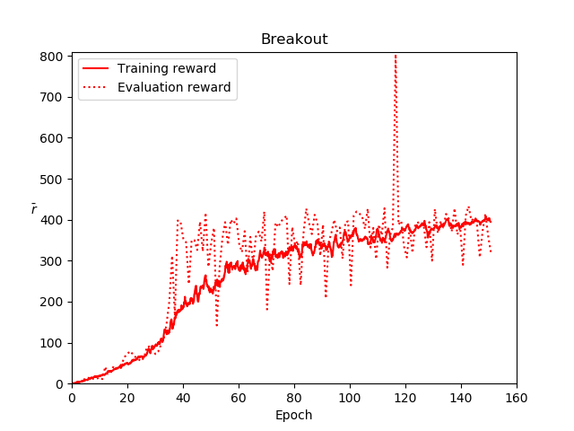

# Practice Double Deep Q-Learning with Dueling Network Architecture for Breakout

This is fork from [fg91/Deep-Q-Learning](https://github.com/fg91/Deep-Q-Learning). I modified a little bit of the original code and trained it for Breakout. Maximum evaluation score was 804 (GIF shown above).

## Modification from the original code
* Modify ReplayMemory to sample from all possible index.
* Clip rewards ("fixed all positive rewards to be 1 and all negative rewards to be -1, leaving 0 rewards unchanged") as [Mnih et al. 2013](https://arxiv.org/abs/1312.5602) and [Mnih et al. 2015](https://www.nature.com/articles/nature14236/). (This made convergence speed of training significantly faster and improved the performance of the agent in case of Breakout.)
* Record evaluation score appropriately even if no evaluation game finished. (Unfinished evaluation game can happen when ["the agent got stuck in a loop"](https://github.com/fg91/Deep-Q-Learning/issues/1).)

## Training Result

## Requirements
* tensorflow-gpu
* gym
* gym[atari] (make sure it is version 0.10.5 or higher/has BreakoutDeterministic-v4)
* imageio
* scikit-image

## Try it yourself:

If you want to test the trained network (which achieves score of 804), simply run the notebook DQN.ipynb.

If you want to train the network yourself, set TRAIN = True in the first cell of DQN.ipynb and run the notebook.