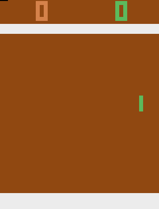
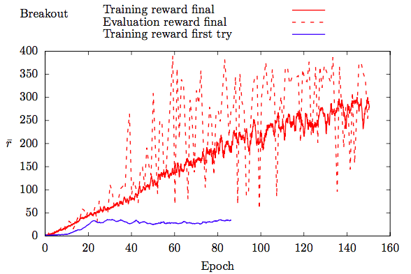
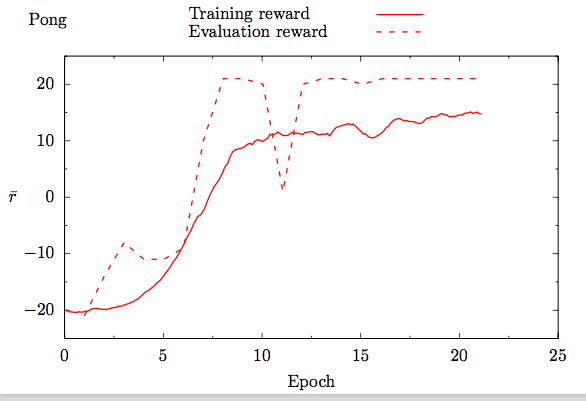

 

# Double Deep Q-Learning with Dueling Network Architecture

You find detailed explanations on the functional and underlying priciples of DQN in the notebook DQN.ipynb and the [corresponding blogpost](https://medium.com/@fabiograetz/tutorial-double-deep-q-learning-with-dueling-network-architectures-4c1b3fb7f756).

## Requirements
* tensorflow-gpu
* gym
* gym[atari] (make sure it is version 0.10.5 or higher/has BreakoutDeterministic-v4)
* imageio
* scikit-image

## Try it yourself:

If you want to test the trained network, simply run the notebook DQN.ipynb.

If you want to train the network yourself, set TRAIN = True in the first cell of DQN.ipynb and run the notebook.

 

Have fun : )